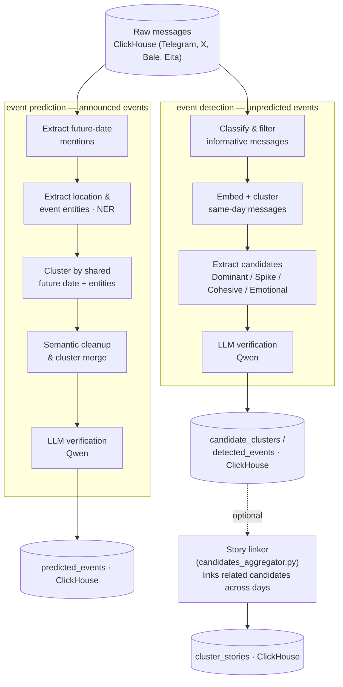

# Event Recognition — Detecting & Predicting Events from Persian Social Media

Surface real-world events from the noise of Persian-language social media (Telegram, X, Bale, Eita) using semantic clustering and LLM verification — for events that **already happened unexpectedly** as well as events that are **announced in advance**.


-purple)


---

## Table of Contents

- [Overview](#overview)
- [Two Kinds of Events, Two Arms](#two-kinds-of-events-two-arms)
- [High-Level Data Flow](#high-level-data-flow)
- [Repository Structure](#repository-structure)
- [Event Detection — How It Works](#event-detection--how-it-works)
- [Event Prediction — How It Works](#event-prediction--how-it-works)
- [Shared Dependency: the Embedding Model](#shared-dependency-the-embedding-model)
- [Requirements](#requirements)
- [Configuration](#configuration)
- [Usage](#usage)

---

## Overview

Every day, millions of Persian-language messages are posted across social platforms. Somewhere in that stream are the messages that actually matter: a strike, a market crash, an official visit, a stadium concert, an unexpected resignation. The rest is routine chatter, ads, jokes and reactions to old news.

This project tries to automatically pull the *actual events* out of that stream, without any manual monitoring. It does this in two complementary ways, because "an event showing up in social media" comes in two fundamentally different shapes.

## Two Kinds of Events, Two Arms

- **Unpredicted events** — something happens *now*, without warning, and people immediately start talking about it. There is no announcement to parse; the only signal is that an unusual amount of today's conversation is suddenly concentrated on the same topic. This is handled by the **`event detection`** arm: it watches the shape of today's conversation itself (volume, timing, cohesion, emotional reaction) and flags clusters of messages that stand out from the normal daily pattern, then asks an LLM to confirm that the flagged cluster really is a single, significant, fresh event.

- **Predicted (announced) events** — something is going to happen *later*, and people are already talking about it today: a concert next month, a state visit next week, an election date. Here the signal isn't statistical anomaly — it's the literal content of the message: a future date, plus a place and/or a named actor. This is handled by the **`event prediction`** arm: it extracts explicit or relative future-date mentions from the text, extracts the location/actor entities near them, groups messages that point at the same future happening, and again asks an LLM to confirm the group genuinely describes one significant planned event (as opposed to a weather forecast, a scheduled power-outage notice, or other routine, recurring content).

Both arms read from the same raw message tables, both use the same Persian-fine-tuned embedding model for the semantic parts of their pipeline, and both end with an LLM verification step — but the way each arm gets from "raw text" to "candidate event" is entirely different, because unexpected and planned events leave different fingerprints in the data.

## High-Level Data Flow



## Repository Structure

```
event-recognition/
├── event detection/            # Arm 1 — unpredicted / breaking events
│   ├── main.py                 # Orchestrates the day-by-day detection pipeline
│   ├── data_loader.py          # Fetches raw messages + sentiment/emotion labels
│   ├── classifier.py           # Filters messages down to "informative" ones
│   ├── clustering.py           # Same-day semantic clustering (graph + Leiden)
│   ├── candidate_extractor.py  # Scores clusters and picks out candidate events
│   ├── event_verifier.py       # LLM (Qwen) confirmation of each candidate
│   ├── data_writer.py          # Persists candidates & confirmed events
│   └── candidates_aggregator.py# Optional: links candidates into cross-day "stories"
└── event prediction/           # Arm 2 — announced / future events
    ├── main.py                 # Orchestrates the day-by-day prediction pipeline
    ├── data_loader.py          # Fetches raw messages
    ├── temporal_extractor.py   # Extracts & normalizes future-date mentions
    ├── location_extractor.py   # NER: extracts location & event entities
    ├── event_clusterer.py      # Groups messages by shared future date + entities
    ├── post_cluster.py         # Embedding-based cluster cleanup & merge
    ├── event_verifier.py       # LLM (Qwen) confirmation of each cluster
    └── data_writer.py          # Persists confirmed predicted events
```

Both `main.py` scripts process data **one calendar day at a time**, loading and releasing GPU models as they go, so the whole pipeline can run on a single modest GPU without ever holding the classifier/embedder/NER model and the LLM in memory at the same time.

---

## Event Detection — How It Works

Goal: out of everything posted **today**, find the handful of message clusters that represent a genuine, fresh, large-scale happening — as opposed to routine chatter, scheduled announcements, or gradual/background trends.

1. **Load the day's messages.** All messages for the target date range are pulled from ClickHouse, along with any pre-computed sentiment/emotion labels for the same messages (used later as an optional signal).

2. **Classify & filter (Phase 1).** A fine-tuned classifier discards messages that aren't informative content worth clustering (ads, boilerplate, too-short text, etc.), so the expensive steps below only run on messages that could plausibly describe something happening in the real world.

3. **Embed & cluster (Phase 2).** The surviving messages for the day are embedded with the Persian-fine-tuned model and grouped into semantic clusters: messages whose embeddings are similar enough are connected in a graph, and a community-detection algorithm (Leiden) splits that graph into topic clusters. This step only looks at *that day's* messages — it's asking "what topics is everyone talking about today?", with no notion yet of whether any of them is unusual.

4. **Extract candidates (Phase 3).** This is where "ordinary busy topic" is separated from "something actually happened". Each cluster is scored against four independent, rule-based signals, and only needs to pass **one** of them to become a candidate:
   - **Dominant** — the cluster is a statistical outlier in size compared to every other topic discussed that day.
   - **Spike** — the cluster's messages are unusually concentrated in a short burst of hours rather than spread evenly across the day (the classic signature of a real-time reaction to breaking news).
   - **Cohesive & Large** — the cluster covers a large-enough share of the day's conversation *and* its messages are tightly focused on the same specific point (as opposed to a broad, loosely related topic).
   - **Emotional Reaction** — the cluster shows a strong, consistent, non-neutral emotional reaction shared across most of its messages (only evaluated when enough messages in the cluster have reliable sentiment/emotion labels).

   Clusters that trigger more than one of these signals score higher, since a topic that is simultaneously unusually large, bursty *and* emotionally charged is much more likely to be a real event than one that only barely crosses a single threshold. Each surviving candidate is stored with a compact set of representative messages (the ones closest to the cluster's semantic centroid) and a handful of extracted keywords, rather than every message in the cluster.

5. **LLM verification (Phase 4).** A locally-run, 4-bit-quantized Qwen model receives a sample of each candidate's messages and is asked a single, strict question: is this a **specific, fresh, unexpected, nationally-significant** event — or is it a scheduled/recurring item (market prices, weather, routine announcements), a local incident, gradual background news, or an unrelated mix of messages that just happened to cluster together? Only candidates the model explicitly confirms are written out as detected events; everything else is kept as a rejected candidate for traceability.

6. **(Optional) Story linking.** Because the pipeline runs day by day, the same real event can produce a new candidate cluster on several consecutive days (e.g. a story that keeps developing). A separate, standalone script (`candidates_aggregator.py`) can be run afterwards — manually or on a schedule — to link candidates across days into a single ongoing "story" by comparing cluster centroids over time, so a multi-day event isn't reported as several disconnected ones.

## Event Prediction — How It Works

Goal: out of everything posted **today**, find messages that describe a specific, significant, **planned** event happening at some point in the near future — as opposed to weather forecasts, scheduled power-cut notices, or other recurring content that also happens to mention a date.

1. **Load the day's messages.** Same idea as the detection arm: one calendar day of messages is fetched at a time from ClickHouse.

2. **Extract future-date mentions.** Every message is scanned for a date reference — explicit (`"روز پنج‌شنبه ۱۴۰۴/۰۷/۱۲"`) or relative to when it was posted (`"سه‌شنبه آینده"`, `"دو هفته دیگه"`, `"فردا"`). Everything is normalized against the message's own post date; only messages whose extracted date actually lies **in the future** relative to when they were posted are kept — a message merely reminiscing about the past is discarded at this stage.

3. **Extract location & event entities.** The remaining, future-dated messages are run through a named-entity-recognition model that pulls out place names and event-referring phrases. A message needs at least a future date to reach this stage; the location/event entities are what will later be used to tell "these messages are all about the *same* future happening" apart from "these messages just happen to mention the same date".

4. **Cluster by shared future date + entities.** Messages are grouped by the future date they point to, and, within each date, connected into clusters using a tiered approach: first, messages that share **both** a location and an event entity are grouped together (the strongest signal); anything left over is grouped by a shared location alone, then by a shared event entity alone; anything that still doesn't share an entity with anyone else becomes its own single-message cluster, to be resolved semantically in the next step rather than being dropped.

5. **Semantic cleanup & merge.** Each cluster is embedded and cleaned up: messages that turn out to be near-duplicates of each other are deduplicated, messages that are only weakly related to the rest of their cluster are dropped as noise, and separate clusters that talk about the same future happening (same date, semantically near-identical content) are merged into one. This step exists because the rule-based clustering in step 4 is intentionally permissive — it's designed to catch every plausible grouping, and this step is what filters that down to clean, coherent clusters.

6. **LLM verification.** A sample of each surviving cluster's messages is sent to the same kind of locally-run Qwen model used by the detection arm, but with a different verification standard: is this cluster describing a *specific, planned* event — due to happen within roughly the next month — that involves a genuinely significant actor (a government body, a well-known organization, a sports club, a recognized public figure)? Routine or recurring content that happens to mention a date (weather forecasts and scheduled power-outage notices are explicitly called out and rejected), ordinary local announcements, and anything already in the past are all rejected. Only clusters the model confirms are written out as predicted events, each carrying the event's predicted date, predicted location, title and a short summary.

---

## Shared Dependency: the Embedding Model

Both arms lean on the same fine-tuned Persian **BGE-M3** embedding model for their semantic steps (same-day clustering in `event detection/clustering.py`, and cluster cleanup in `event prediction/post_cluster.py`). Both import it the same way:

```python
from utils import similarity_model
from preprocessing import dynamic_preprocess, PreprocessingOptions
```

`utils.py` and `preprocessing.py` are **not included in this repository** — they're the same embedding wrapper and Persian text-preprocessing module used by the companion [`sts`](https://github.com/mostafamhm/sts) project. To run either arm, copy `embedding/utils.py`, `embedding/preprocessing.py` and the fine-tuned model referenced by `embedding/config.yaml` from that project (or place this repository alongside it) so both modules are importable from `event detection/` and `event prediction/`.

## Requirements

- Python **3.9+**
- Access to the **ClickHouse** database holding the raw platform messages, plus the **PostgreSQL** database holding topics/keywords (same databases used by the [`sts`](https://github.com/mostafamhm/sts) project)
- An NVIDIA GPU (recommended) for the classifier/embedding/NER models and for the 4-bit Qwen verifier
- The fine-tuned classifier, embedding, NER and Qwen model weights available locally
- `utils.py` and `preprocessing.py` from the `sts` project's `embedding/` folder (see above)

Python packages used across both arms: `pandas`, `numpy`, `torch`, `transformers`, `bitsandbytes`, `sentence-transformers`, `clickhouse-connect`, `pg8000`, `python-dotenv`, `jdatetime`, `igraph`, `leidenalg`, `networkx`, `scikit-learn`, `emoji`, `parstdex`, `tqdm`, `psutil`.

## Configuration

Both arms read their ClickHouse/PostgreSQL connection settings from environment variables (`CH_HOST`, `CH_PORT`, `CH_USER`, `CH_PASS`, `PG_HOST`, `PG_PORT`, `PG_USER`, `PG_PASS`, `PG_DB` — the same convention used by the `sts` project), typically supplied through a `.env` file loaded with `python-dotenv`. Model paths (classifier, location NER, Qwen) are passed as command-line arguments, shown below.

## Usage

**Event detection** (run from inside `event detection/`):

```bash
python3 main.py --db-name telegram --table-name posts --start-date 1404-06-06 --end-date 1404-06-08
```

**Event prediction** (run from inside `event prediction/`):

```bash
python3 main.py --db-name telegram --table-name posts --start-date 1404-06-06 --end-date 1404-06-08
```

**Story linking** (optional, run from inside `event detection/` after one or more detection runs):

```bash
python3 candidates_aggregator.py
```
